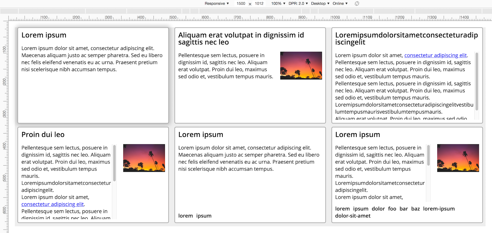
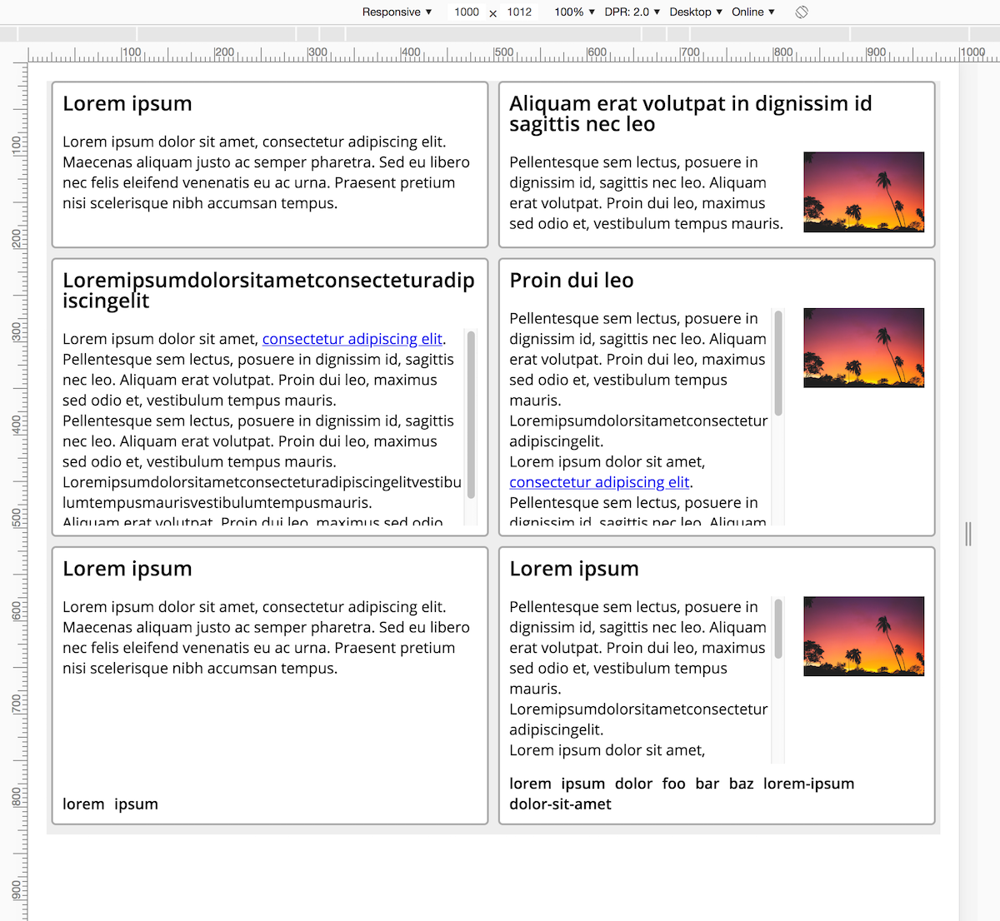
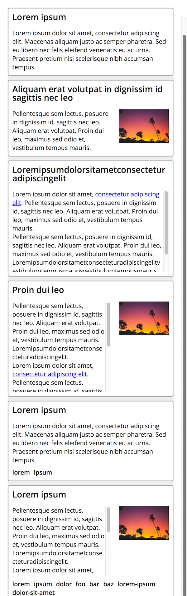

# Verkefni 5

Útfæra skal birtingu með flexbox eftir fyrirmynd.

Gefin er `index.html` skrá sem _ekki_ skal eiga við fyrir utan að bæta skal við `class` við element þar sem þarf. Heiti þessara klasa skulu fylgja BEM .

Fyrir útlit gildir:

* Gefin er breidd á `<main>` og bakgrunnslitur á `.cards` til að bera saman við fyrirmynd
* Open sans er uppsett og skal nota fyrir allan texta
* Stærðir á textum:
  - Grunnstærð: `16px`
  - Fyrirsagnir: `22px` með `22px` línuhæð
  - Texti: `16px` með `22px` línuhæð
* Flexbox skal notað til að stýra öllu útliti
* Fyrir `.cards` gildir að börnum skal dreift með `space-around`
* Fyrir `.card` gildir
  - `#fff` bakgrunnur
  - `2px` border með `5px` radíus í `#aaa` lit
  - Að hámarki `470px` að breidd og `300px` á hæð
  - Allt efni sem myndi flæða út fyrir skal ekki sjást
  - Að neðan skal vera `10px` margin
  - Löng orð sem _brotið_ gætu útlit ættu ekki að gera það, finna þarf CSS yfirlýsingu sem brýtur þessi orð í línur
  - Ef efni myndi flæða út fyrir skal birta skrunstikur
  - Mynd skal taka `150px` hægra megin við efni

## Takmarkanir

Leyfilegt er að nota þær CSS yfirlýsingar sem farið hefur verið yfir og þær sem bæta þarf við til að uppfylla verkefnalýsingu.

Einungis skal notast við flexbox til að stýra útliti og eru því eftirfarandi yfirlýsingar ekki leyfðar:

* `display` með annað gildi en `flex`, sjálfgefin gildi eru þó leyfð
* `float`
* `position`

## Fyrirmyndir

Sjá fyrirmyndir í `1500px`, `1000px` og `500px` breiðum skjám:

## Mat

* 20% – Snyrtilega uppsett, merkingarfræðilegt og gilt HTML sem notar BEM fyrir klasanöfn
* 20% – Snyrtilega uppsett, gilt CSS sem virðir takmarkanir
* 60% – Útlit útfært eftir forskrift

## Sett fyrir

Verkefni sett fyrir í fyrirlestri mánudaginn 24. september 2018.

## Skil

Skila skal undir „Verkefni og hlutaprófa“ á Uglu í seinasta lagi fyrir lok dags þriðjudaginn 2. október 2018.

Skilaboð skulu innihalda slóð á GitHub repo fyrir verkefni, og dæmatímakennurum skal hafa verið boðið í repo ([sjá leiðbeiningar](https://help.github.com/articles/inviting-collaborators-to-a-personal-repository/)). Notendanöfn þeirra eru `x`, `x`, `x`, `hinriksnaer`, `gunkol`, `freyrdanielsson` og `osk`.

## Einkunn

Sett verða fyrir tíu minni verkefni þar sem átta bestu gilda 3,5% hvert, samtals 28% af lokaeinkunn.

Sett verða fyrir tvö hópverkefni þar sem hvort um sig gildir 11%, samtals 22% af lokaeinkunn.

---

> Útgáfa 0.1
